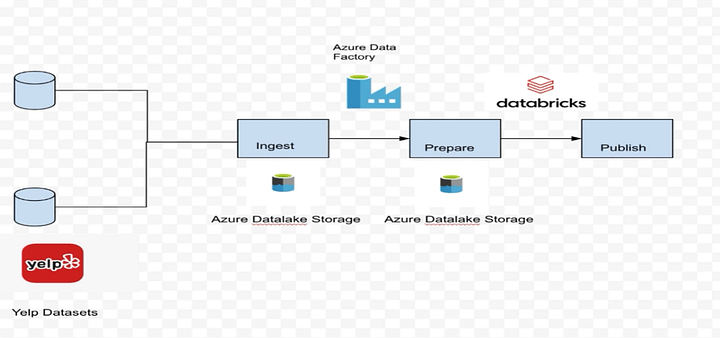

# Analyse-yelp-dataset-using-Azure

In this project, we are going to learn how to analyze yelp dataset using **Spark** and **Parquet** formats. **Yelp** is an online platform designed to help people discover and share reviews and ratings about various businesses, services, and activities. Users can write **reviews**, add photos based on their experiences, and give **ratings**. Yelp also offers a range of search and filtering options so that users can find places or services of interest based on factors such as location, price, rating, etc.

We target this dataset provided by yelp.com as first it is huge and can be analyzed on Spark. And it's kind of semi-structured data in JSON format. To analyze this huge amount of data, it's going to be much faster if we use Spark than traditional mapreduce.

#### Tech Stack

- Language: Python3
- Services: Azure Data factory, Azure Databricks, ADLS

### Implementation

Basically we have 3 use case:

- store the data
- process the data
- other part between data ingestion

We will use these tools:

- Data storage: Azure Datalake Storage (Gen2)
- Data injection: Azure Data Factory
- Data processing: Azure Databricks