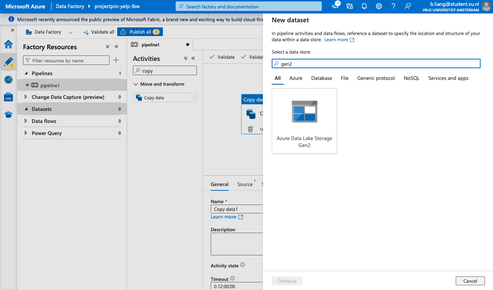
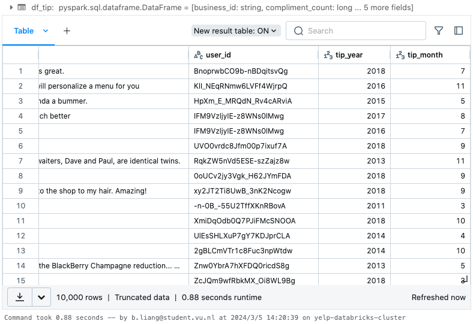

[TOC]

## Analyse Yelp Dataset with Spark & Parquet Format on Azure Databricks

### Introduction

In this project, we are going to learn how to analyze yelp dataset using **Spark** and **Parquet** formats. **Yelp** is an online platform designed to help people discover and share reviews and ratings about various businesses, services, and activities. Users can write **reviews**, add photos based on their experiences, and give **ratings**. Yelp also offers a range of search and filtering options so that users can find places or services of interest based on factors such as location, price, rating, etc.

We target this dataset provided by yelp.com as first it is huge and can be analyzed on Spark. And it's kind of semi-structured data in JSON format. To analyze this huge amount of data, it's going to be much faster if we use Spark than traditional mapreduce.

#### Business Overview

[Azure Databricks](https://learn.microsoft.com/en-us/azure/databricks/introduction/) is a data analytics tool tailored for the Microsoft Azure cloud services platform. In massive data pipelines, raw and structured data is imported into Azure in batches via Azure Data Factory or streamed near real-time via Apache Kafka, Event Hub, or IoT Hub. This data is stored in a data lake for long-term sustained storage, either in Azure Blob Storage or Azure Data Lake Storage. Azure Databricks is utilized to read data from different data sources and transform it into breakthrough insights using Spark as part of the analytics workflow.

[Yelp](https://www.yelp.nl/amsterdam) is a community review site and an American multinational firm based in San Francisco, California. It publishes crowd-sourced reviews of local businesses as well as the online reservation service Yelp Reservations. Due to the bulk of the data, this project only selects a subset of Yelp data in a zip file named 'dataset.zip,' which comprises three JSON files, including 'business.json', which provides business data such as location data, attributes, and categories. To download the dataset, click [here](https://www.yelp.com/dataset/download). To get more details about the dataset, click [here](https://www.yelp.com/dataset/download). We use 'business.json', 'review.json', 'user.json', 'checkin.json' and 'tip.json'.

#### Dataset Analysis

Dataset Analysis is defined as the process of manipulating or processing unstructured data or raw data to draw useful insights and conclusions which will help derive key decisions that will add some business value. The dataset analysis process is followed by organizing the dataset, transforming the dataset, visualizing the dataset finally modelling the dataset to derive predictions for solving the business problems, making informed decisions and effectively planning for the future.

#### Data pipeline

A data pipeline is a technique for transferring data from one system to another. The data may or may not be updated, and it may be handled in real-time (or streaming) rather than in batches. The data pipeline encompasses everything from harvesting or acquiring data using various methods to storing raw data, cleaning, validating, and transforming data into a query-worthy format, visualisation of KPIs including Orchestration of the above process is data pipeline.

#### Tech Stack

- Language: Python3
- Services: Azure Data factory, Azure Databricks, ADLS

### Solution Architecture


**ELT process**:

- Download the dataset from yelp website locally.
- Put our source data to `Azure Datalake Storage`. Create a container for source data. [source container]
- Create another container where we will move our data. [target container]
- Use `Azure Data Factory` to transfer data from source to target.
- Use `Databricks` to analyze our data. `Databricks` provide an environment where we can analyze our data in `PySpark`.
- Plot a graph on top of our analyze data which is very useful from business point of view.

**Usage of Dataset:**

Here we are going to use Yelp data in the following ways:

- Conversion: During the conversion process, the Yelp academic dataset JSON file is converted to Parquet format and for further data analysis in Databricks.

- Transformation and Load: During the transformation and load process, the uploaded dataset in Spark is read into Spark data frames. And dataset is finally analyzed in Databricks into Spark and further recommendations are deduced.

### Implementation

Basically we have 3 use case:

- store the data
- process the data
- other part between data ingestion

We will use these tools:

- Data storage: Azure Datalake Storage (Gen2)
- Data injection: Azure Data Factory
- Data processing: Azure Databricks

#### Create Resource Group and upload dataset

1. First, create a `Resource Group`. Resource Group is a **container** that holds related resources for an Azure solution.

   - Select subscription

   - Provide a unique Resource Group name

   - Select a region


In this resource group we can create our storage account, database account, data factory account.

2. Now we can make a data storage account.

   - Select subscription

   - Select resource group

   - Provide a unique account name (here I use lbwprojectyelp)

   - Select a region

   - Other options remain the same


3. Create a container to store our source data.
   - Provide a unique container name


4. Upload our source data.

   - Click the container we just created and click on the `Upload` button.

   - Upload our 5 JSON files.


#### Use Data Factory to copy data

Once the data is uploaded, we can use `Azure Data Factory` to transfer the data from source container to destination container. Now let's set up `Data factory`.


We have created the Data factory. Open the studio, we gonna create a pipeline which will basically move data from source to destination container or target container. Create a new pipeline.


Select the transformation `copy data`, drag and drop it. Now we have the **source** and **sink**. We need to create 2 datasets (containers). One is our source container and the other is the target container.



Select `Binary` format since our data is in binary format.


Now we have to provide the file path. Click on the `file` button, we got the following error:


In order to tackle this particular error, we have to go to our storage account. Click on the `Data protection` button.


Disable the `Enable soft delete for blobs` option and save.


Now we can browse the folder. Select the source container and click on OK. We have our source dataset here.


We need to set up target dataset. So again we need to create a container.


Again, create a new dataset.


Go to the pipeline and set the `Source` and `Sink` and click on `Validate`.


Click on the `Debug` button to run in a debug mode.


The JSON files have been copied to the target container. Now we can go and **publish** all.

If the test is successful, submitting all the components created in ADF along with their corresponding properties settings is equivalent to **publishing**. This operation is similar to saving a pipeline. If a Git account is configured, all changes will be written to the Git repository.

#### Set up Azure Databricks Cluster 

First create the Databricks service.


Launch the workspace and create a new cluster. 

> Note: the `Enable autoscaling` option: compute that automatically scales between the minimum and maximum number of nodes, based on load. If multiple jobs are running in the cluster, then the cluster will optimize it.


Now let's create a new folder named `yelp-dataset-analysis`. Inside the folder, create a new notebook named `yelp-dataset-analysis`.


- [Set ADLS configurations.](https://learn.microsoft.com/en-us/azure/databricks/connect/storage/azure-storage)

  - ```python
    spark.conf.set("fs.azure.account.key.<storage-account>.dfs.core.windows.net","<storage-account-access-key>")
    ```

  - Copy the account name and key in the `Access keys`.

- List Datasets in ADLS

  - ```python
    dbutils.fs.ls("abfss://<container-name>@<storage-account-name>.dfs.core.windows.net/")
    ```

  - This command will list all the datasets in the container.

- Read yelp datasets in ADLS and convert **JSON** to **parquet** for better performance

  - ```python
    df_business = spark.read.json("abfss://yelpdataset-target@yelpprojectlbw.dfs.core.windows.net/yelp_academic_dataset_business.json")
    df_business.write.mode('overwrite').parquet("abfss://yelpdataset-target@yelpprojectlbw.dfs.core.windows.net/json_to_parquet/business.parquet")
    ```


​	Now we can see the parquet files.

- Convert JSON to Delta Format (more efficient in Databricks than parquet)

  - ```python
    df_business.write.mode('overwrite').parquet("abfss://yelpdataset-target@yelpprojectlbw.dfs.core.windows.net/json_to_delta/business.delta")
    ```

    

- In this project we gonna use **parquet** only. Read all the datasets created.

  - ```python
    df_business = spark.read.parquet("abfss://sourcecontainer@sgyelp.dfs.core.windows.net/json_to_parquet/business.parquet")
    df_checkin = spark.read.parquet("abfss://sourcecontainer@sgyelp.dfs.core.windows.net/json_to_parquet/checkin.parquet")
    df_review = spark.read.parquet("abfss://sourcecontainer@sgyelp.dfs.core.windows.net/json_to_parquet/review.parquet")
    df_tip = spark.read.parquet("abfss://sourcecontainer@sgyelp.dfs.core.windows.net/json_to_parquet/tip.parquet")
    df_user = spark.read.parquet("abfss://sourcecontainer@sgyelp.dfs.core.windows.net/json_to_parquet/user.parquet")
    ```

- Check the total amounts of each dataframe.

  - ```python
    print("df_tip: " + str(df_tip.count()))
    print("df_checkin: " + str(df_checkin.count()))
    print("df_business: " + str(df_business.count()))
    print("df_review: " + str(df_review.count()))
    print("df_user: " + str(df_user.count()))   
    ```

- Partition our dataset based on `year` and `month`. We just have `date` column, so we should first add 2 columns `year` and `month`.

  - ```python
    #import packages
    import pyspark.sql.functions as f
    from pyspark.sql.window import Window
    
    df_tip = df_tip.withColumn("tip_year", f.year(f.to_date(f.col("date"))))
    df_tip = df_tip.withColumn("tip_month", f.month(f.to_date(f.col("date"))))
    ```



- Partition the dataset `tip` by `year` and `month`.

```python
df_tip.write.mode("overwrite").partitionBy("tip_year", "tip_month").parquet("abfss://yelp-target-container@yelpprojectlbw.dfs.core.windows.net/tip_partitioned_by_year_and_month/")
```


Now we can see the partitioned data. We have partitioned our dataset or we initially have a user dataset that are not of equal size (some are very small, some are very large). The files are not evenly distributed. Balancing file sizes can optimize the utilization of cluster resources during Spark job execution.

When we run a spark job, it automatically determines number of partition. Sometimes this will lead to out of memory problem. We can break down the huge partition into smaller number of partition. We can do `repartition` or `coalesce` to change the number of partitions. 

**Difference between `repartition` and `coalesce`**

[Coalesce](https://learn.microsoft.com/en-us/azure/databricks/sql/language-manual/functions/coalesce) operation attempts to merge data into fewer partitions as much as possible without performing a complete shuffle. Therefore, it may result in significantly different data volumes in some partitions, with some partitions potentially being larger than others. In contrast, the [repartition](https://learn.microsoft.com/en-us/azure/databricks/sql/language-manual/sql-ref-syntax-qry-select-hints) operation creates entirely new partitions and performs a full shuffle to ensure roughly equal-sized partitions.

Then, the issue of which operation is faster is addressed. The text points out that while the coalesce operation may be faster than the repartition operation, handling unevenly sized partitions typically slows down performance compared to handling evenly sized partitions. This is because Spark operates more efficiently when dealing with equally sized partitions. Therefore, when working with large datasets with uneven partition sizes, it is usually necessary to perform a repartition operation on the dataset to ensure better performance.

```python
# coalesce
df_user.coalesce(10).write.mode('overwrite').parquet("abfss://yelp-target-container@yelpprojectlbw.dfs.core.windows.net/coalesce/user.parquet")

# repartition
df_user.repartition(10).write.mode('overwrite').parquet("abfss://yelp-target-container@yelpprojectlbw.dfs.core.windows.net/repartition/user.parquet")
```


The file sizes in the `repartition` are nearly equal. The files in the `coalesce` are not evenly distributed. But `coalesce` took less time than `repartition`. In real work scenario, `repartition` is preferred.


#### Perform analysis on partitioned data

We will use the repartitioned dataset to perform analysis. Detailed data analysis and results can be found in the notebook.